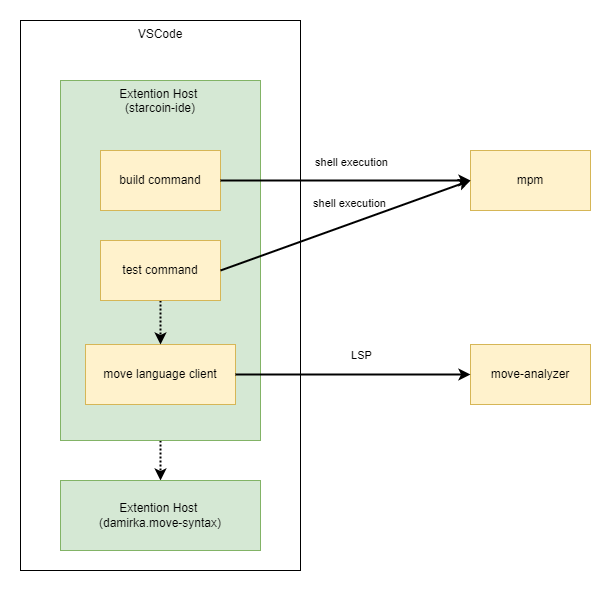

## On Contributing

To contribute to the Starcoin IDE, first start with the proper
development copy.

To start developing, run the following:

```bash
git clone https://github.com/starcoinorg/starcoin-ide.git
cd starcoin-ide
yarn install
yarn dev
```

To test the extension, run the following:
```bash
yarn test
```

## The Architecture



We integrate mpm to build, test, and package Move projects, and
integrate move-analyzer to realize automatic completion of Move code, jump to definition, etc.,
and use the vscode-move-syntax plugin for syntax highlighting.

## Developer Workflow

Changes to the project are proposed through pull requests. The general pull
request workflow is as follows:

1. Fork the repo and create a topic branch off of `master`.
2. If you have added code that should be tested, add unit tests.
3. Make sure your local workspace is clean and all changed file has been committed.
4. Submit your pull request.
5. Waiting for the github action check to pass and responding to reviewer feedback.


## How to update the pull request

If your pull request is out-of-date and needs to be updated because `master`
has advanced, you should rebase your branch on top of the latest main by
doing the following:

```bash
git fetch upstream
git checkout topic
git rebase -i upstream/master
```

You *should not* update your branch by merging the latest main into your
branch. Merge commits included in PRs tend to make it more difficult for the
reviewer to understand the change being made, especially if the merge wasn't
clean and needed conflicts to be resolved. As such, PRs with merge commits will
be rejected.

## Issues

Starcoin IDE uses [GitHub issues](https://github.com/starcoinorg/starcoin-ide/issues) to track
bugs. Please include necessary information and instructions to reproduce your
issue.